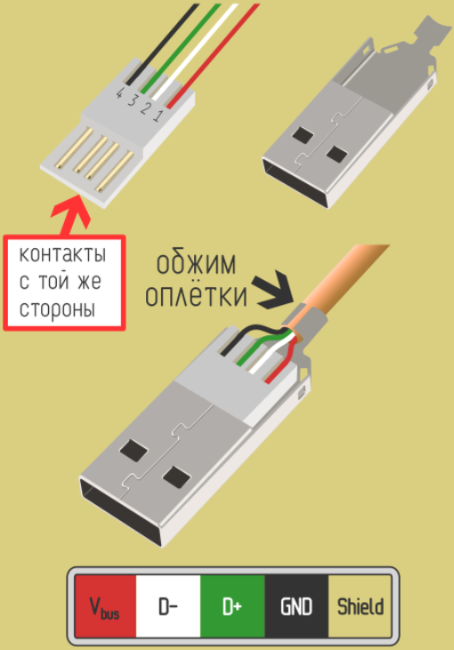
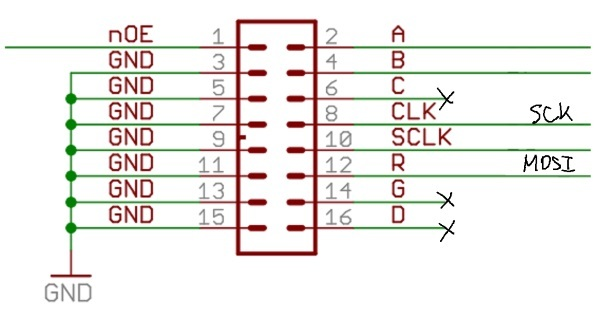

# **Лаборатораня работа №2**
## Знакомство и передача данных по USB. Работа с Led Board P10.

## Задание
Реализовать вывод апериодичесткого звена 2-го порядка на Led Board P10. Передача данных осуществляется с помощью двух STM32 (одна - расчитывает данные и их отправляет, вторая - принимает данные и отрисовывает график). Взаимодействие двух STM32 реализовать через *USB*. 

*Дополнительное задание*: При нажатии на кнопку на график вводятся возмущение любого характера.

## Краткое описание
В ходе данной работы необходимо обеспечить обмен данных между двумя микроконтроллерами STM32 для визуализации графика апериодического звена 2-го порядка на LED-панель P10. Взаимодействие двух микроконтроллеров обеспечивается посредством *USB*. Один микроконтроллер отвечает за математические расчёты и в последующем отправку данных. Второй микроконтроллер должен принимать данные и выводить изображение графика на экран.

Код для программы был написал на языке **С**. Для реализации прыжка была использована кнопка на отладочной плате.

Листинги программного кода для математических расчётов и отправки данных можно посмотреть в директории `Project_LB1/Core/Src` в файлах [main.c](Lab_1/Lab_5_fix/Core/Src/main.c), [stm32f4xx_it.c](Lab_1/Lab_5_fix/Core/Src/stm32f4xx_it.c) и [stm32f4xx_it.c](Lab_1/Lab_5_fix/Core/Src/stm32f4xx_it.c).

Листинги программного кода для приема данных и отрисовки графика можно посмотреть в директории `Project_LB1/Core/Src` в файлах [main.c](Lab_1/Lab_5_fix/Core/Src/main.c), [stm32f4xx_it.c](Lab_1/Lab_5_fix/Core/Src/stm32f4xx_it.c) и [stm32f4xx_it.c](Lab_1/Lab_5_fix/Core/Src/stm32f4xx_it.c).

Отчёт к данной работе: <https://docs.google.com/document/d/1bmmBl_UGj2rrcNi57MLyHoi01FUQnBxSzopLlw7OWnQ/edit>

Видео-отчёт: [Google_Dino.mp4](Google_Dino.mp4)

### ***Universal Serial Bus*** или ***USB***. Основные моменты
**USB** (англ. *Universal Serial Bus* — «универсальная последовательная шина») — последовательный интерфейс для подключения периферийных устройств к вычислительной технике. Получил широчайшее распространение и стал основным интерфейсом подключения периферии к бытовой цифровой технике.

Интерфейс позволяет не только обмениваться данными, но и обеспечивать электропитание периферийного устройства. Сетевая архитектура позволяет подключать большое количество периферии даже к устройству с одним разъёмом USB.

В рамках лабораторной работы имеем USB-A на компьютер и USB Micro-B на отладочной плате BluePill.

Распиновка для USB-A

Распиновка для USB Micro-B

#### Метод связи
Спецификация *USB* предлагает разработчику несколько вариантов устройств в зависимости от требуемой скорости обмена данными. Это *Low Speed* (физическая скорость 1,5 Мбит/с ± 1,5 %), *Full Speed* (12 Мбит/с ± 0,25 %), *High Speed* (480 Мбит/с ± 0,05 %), *SuperSpeed* (5 Гбит/с ± 0,06 %), *SuperSpeed+* (10 Гбит/с). Low-, Full- и High-Speed-устройства используют одну дифференциальную полудуплексную линию связи для обмена данными, SuperSpeed — несколько. Протоколы обмена идентичны.

*USB* представляет собой сеть с одним мастером (*хостом*) и произвольным количеством подчинённых устройств (*device*). Топология сети — активное дерево. «Активное» означает, что в каждом узле дерева находится специальное устройство — концентратор (хаб). Хаб занимается электрическим согласованием кабелей, маршрутизацией пакетов, обнаружением подключения/отключения устройств и другими функциями. Все соединения в сети электрически и протокольно идентичны.

*USB* позволяет выполнять «горячее» подключение и отключение отдельных устройств или сегментов сети. «Горячее» означает, что работа сети при этом не нарушается, а мастер способен определять факт изменения конфигурации сети автоматически, в реальном времени. Поскольку вся сеть получает электропитание от мастера, то поддерживается возможность автоматического контроля энергоснабжения сети: устройство сообщает мастеру о своих потребностях, а мастер может запретить работу устройства, если энергетические возможности сети могут быть превышены.

#### Физический уровень

Когда к хосту никто не подключён, обе сигнальные линии *D+* и *D−* подтянуты резисторами 15 кОм к минусу питания. При подключении устройства одна из линий подтягивается к +3,3 В через резистор 1,5 кОм. Устройства *Low Speed* подтягивают линию *D−*, а устройства *Full Speed* — *D+*. Таким образом хост определяет факт подключения и тип подключённого устройства. Устройства *High Speed* в момент подключения работают как *Full Speed*, переключаясь в высокоскоростной режим после обмена визитками.

Данные кодируются по методу **NRZI** (*Non-return-to-zero inverted*). По этому методу каждому нулевому биту входных данных соответствует изменение состояния дифпары (*J→K* или *K→J*), а при единице изменения нет. Чтобы исключить потерю синхронизации на длительных единичных последовательностях, применяют битстаффинг, то есть принудительно вставляют в поток данных ноль на каждые 6 единиц подряд.

В случае, если сигнал состоит из 6 подряд идущих *1*, то после него всегда ставится фиктивныв нуль.

#### Адрес

*USB* является сетью, то есть к одному хосту может подключаться несколько устройств. Каждому устройству в процессе начального конфигурирования в момент подключения назначается уникальный адрес. Размерность адреса 7 бит, нулевое значение зарезервировано — соответственно, к одному хосту может подключаться до 127 устройств. Поле адреса содержат только те пакеты, что начинают транзакцию (*IN*, *OUT*, *SETUP*).

#### Принципы обмена данными

Обмен данными происходит так называемыми транзакциями — неразрывными последовательностями из нескольких пакетов. Инициатором обмена всегда является хост. Он передаёт короткий пакет (*token*), уведомляющий о начале новой транзакции. В этом пакете-токене хост указывает направление транзакции (*IN* или *OUT*), адрес устройства и номер *endpoint*. Например, токен *OUT* означает, что немедленно за токеном последует пакет с данными от хоста к устройству (*DATA0* или *DATA1*). Пакетов с данными может быть несколько в одной транзакции, если каждый из них имеет максимально допустимую для этого устройства длину данных. Окончание пересылки данных определяется по длине пакета, не равной максимальной. Как только приходит укороченный пакет, устройство немедленно передаёт ответный пакет-подтверждение (*handshake*), например *ACK* (всё успешно принято), *NACK* (не смог принять: например, переполнен входной буфер), *STALL* (данные адресованы отключённому *endpoint*). Все пакеты в транзакции передаются практически слитно, максимальная пауза между пакетами не должна превышать ~1 мкс (для *Full Speed*), иначе транзакция будет признана ошибочной.

## LED-панель P10. Основные моменты

**LED-панель P10** или **P10 Led Board** - панель, состоящая из корпуса, светодиодов и управляющих микросхем. Размерность данной модели составляет 16 пикселей на 32 пикселя. Работа с данной панелью осуществляется по протоколу *SPI* с использованием *SCK* и *MOSI*.

Основные параметры данной панели:

* Размер: 32 (длина) на 16 (высота) в светодиодах

* Питающее напряжение: 5 вольт постоянного тока

* Максимальное потребление тока: 5 ампер

* Максимальная мощность: 25 Ватт

Ниже представлено изображение коннекторов на LED-панели и их распиновка. Включать их следует строго в таком порядке. Если при подключении плата никак не реагирует, попробуйте перевернуть разъем.

На разъёме:

* ***C***, ***G***, ***D*** — не используются (возможно они используются в 3-цветных матрицах).

* ***A*** и ***B*** — задают, какая из 4 групп светодиодов экрана работает в данный момент. Матрицы используют динамическую индикацию, поочерёдно переключая 4 группы светодиодов в зависимости от логических уровней на ножках *A* и *B*. На плате эти сигналы приходят на дешифратор D18, который открывает 1 из 4 групп P-канальных полевиков, тем самым подавая +5В на аноды светодиодов выбранной группы.

* ***nOE*** — разрешает работу матрицы (лог. 0 гасит все матрицы в цепочке).

* ***MOSI*** — канал передачи данных.

* ***SCLK*** — канал подтверждения конца загрузки байта данных.

* ***SCK*** — канал для синхронизации частот работы периферии.

Ниже приведена принципиальная схема LED-панели P10

Логика обновления экрана (точнее четверти экрана) выглядит следующим образом:

1. Выдаём по *SPI* данные для сдвиговых регистров. Для одной матрицы 32x16 это 16 байт (16 8-битных регистров).

2. Устанавливаем лог. 0 на ножке *nOE*.

3. Устанавливаем лог. уровни на ножках *A* и *B* в соответствии с обновляемой группой светодиодов (одной из четырёх). Это подаёт +5В на аноды светодиодов выбранной группы.

4. Выдаём на ножку *SCLK* короткий положительный импульс. Это подаёт землю на катоды светодиодов в соответствии с загруженными в регистры байтами.

5. Устанавливаем лог. 1 на ножке nOE. При этом четверть экрана (одна группа светодиодов) загорается и горит до следующего обновления следующей группы светодиодов.

6. Повторяем пункты **1-5** с постоянным периодом.

### Дополнительная информация

Для дополнительного ознакомления с USB можно посмотреть в следующих видео и сайтах:

- <https://www.youtube.com/watch?v=iRGTrnLAk1s>

- <https://www.youtube.com/watch?v=STL-aahPC-o>

- <https://ru.wikipedia.org/wiki/USB>

- <https://www.dmosk.ru/terminus.php?object=usb>

Для дополнительного ознакомления взаимодействия USB с STM32 можно посмотреть в следующих видео:

- <https://www.youtube.com/watch?v=HS0qGLQTqac>

- <https://www.youtube.com/watch?v=XKCjOlskW78>

- <https://www.youtube.com/watch?v=enZqu2FV1eU>

- <https://youtu.be/92A98iEFmaA?si=x3UDdSgpelijYPwH>

## Основной ход работы

В данной лабораторной работе будет использоваться следующие устройства: 2 *Bluepill* (*STM32F103C8T6*), кнопка, 2 провода *USB-A — USB Micro-B*, компьютер, *Led Board P10* и *DC Power 5V 5A*.

Для осуществления передачи данных будет использоваться ПО ***Hercules SETUP***. Утилита *Hercules SETUP* представляет собой терминал последовательного порта (терминал *RS-485* или *RS-232*), терминал *UDP/IP* и терминал клиента-сервера *TCP/IP*. Благодаря данному ПО мы сможем обеспечить взаимодействие двух *STM* (назначит передачу данных на определенный *COM-порт*).

Ссылка на данное ПО: <https://www.youtube.com/watch?v=iRGTrnLAk1s&t=13s>

Предположительная схема подключения представлена ниже (подключенные пины могут не соответствовать реальному подключению)

### Подключение и настройка NUCLEO-F103C8T6 
#### Работа с микроконтроллером для вычисления и передачи данных

Распиновка микроконтроллера для расчетов и отправки выглядит следующим образом

Перечень используемых пинов:

* PB0 - BUTTON - отвечает за добавление возмущающих значений;

* PH0 - RCC_OSC_IN - канал для подключения внешнего тактового резонатора высокой частоты;

* PH1 - RCC_OSC_OUT - канал для подключения внешнего тактового резонатора высокой частоты.

* PA11 - USB_DP - канал для работы по USB.

* PA12 - USB_DM - канал для работы по USB.

Ниже изображены настройки TIM4 внутри STM32CobeIDE. Используется для счета времени работы.

Ниже изображены настройки для USB внутри STM32CobeIDE.

Ниже изображены настройки для USB_DEVICE внутри STM32CobeIDE.

#### Работа с микроконтроллером для приема данных и их отрисовки

Распиновка микроконтроллера выглядит следующим образом

Перечень используемых пинов:

* PB0 - A - отвечает за выбор строки для загрузки данных;

* PB1 - B - отвечает за выбор строки для загрузки данных;

* PA4 - nOE - отвечает за включение / выключение панели;

* PA6 - SCLK - канал для прменения полученных данных (необходимо подать высокий и следом сразу низкий сигнал);

* PA5 - SPI1_SCK - канал для тактирования ведомого устройства от ведущего;

* PA7 - SPI1_MOSI -канал для передачи данных;

* PH0 - RCC_OSC_IN - канал для подключения внешнего тактового резонатора высокой частоты;

* PH1 - RCC_OSC_OUT - канал для подключения внешнего тактового резонатора высокой частоты.

* PA11 - USB_DP - канал для работы по USB.

* PA12 - USB_DM - канал для работы по USB.

Ниже изображены настройки SPI1 внутри STM32CobeIDE. Он используется для связи с LED-панель

Ниже изображены настройки для USB внутри STM32CobeIDE.

Ниже изображены настройки для USB_DEVICE внутри STM32CobeIDE.

### Скрипт для связи двух COM-портов

Для связи двух COM-портов был написан скрипт [main.py](Python_script/main.py), который помогает передать данные с одного определенного COM-порта на другой. Для этого использовалась библиотека serial и стандарт кодирования знаков ASCII.

## Демонстрация работы панели

Видео с озвучкой [Aper_zveno_2_por.mp4](Aper_zveno_2_por.mp4)

